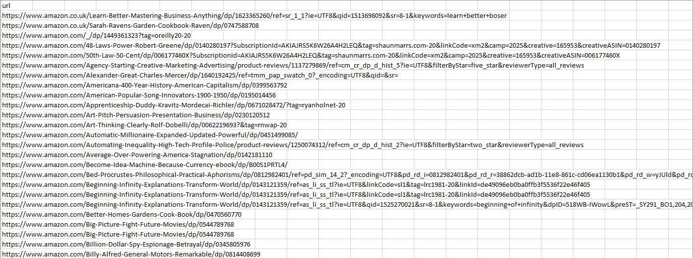
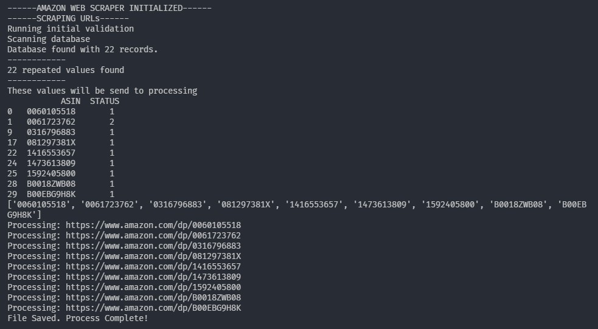
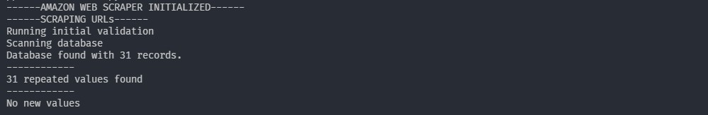
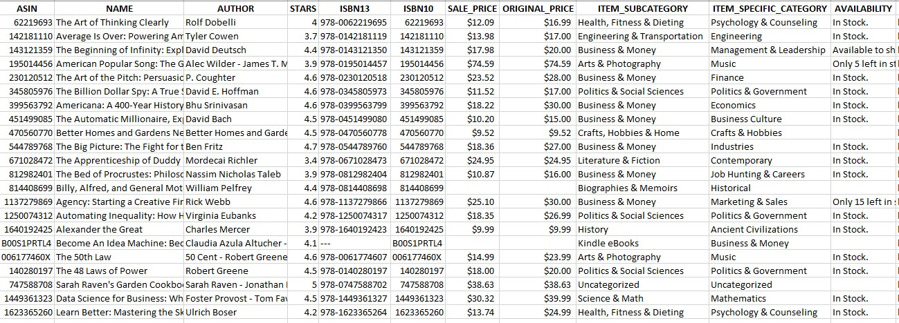

# Amazon Books Web Scraper using Python and Pandas
This program will scrape books **from a list of Amazon links (spreadsheet)**. It will generate a **csv** file with book data such as: 
- ASIN
- Name
- Author
- Stars
- ISBN10 and ISBN13 number
- Item category, subcategory and specific category
- Item availability
- Original price and sale price

<!-- ## Table of Contents
- [Usage Example](#usage-example)
- [Getting Started](#getting-started)
- [Running the tests](#running-the-tests)
- [Built With](#built-with)
- [Contributing](#contributing)
- [Versioning](#versioning)
- [Authors](#authors)
- [License](#license)
- [Acknowledgements](#acknowledgements) -->

---

## Usage Example
**Input links:**



**Usage:**



**Repeated links:**
The program can detect if there are repeated books based on its *ASIN number*, these repeated books won't be scraped.



**Output data:**




## Getting Started
1. Clone the repo
`git clone git@github.com:guidosantillan01/amazon-books-web-scraper.git`

2. Run `modules/main.py` file:
```sh
PYTHON_PATH/python.exe "FOLDER_PATH/amazon-books-web-scraper/modules/main.py"
```
Example:
```sh
C:/ProgramData/Anaconda3/python.exe f:/Downloads/amazon-books-web-scraper/modules/main.py
```


### Prerequisites
- You will need Python. The [Anaconda Distribution](https://www.anaconda.com/distribution/) is recommended.
- Install the VSCode Python extension.
- Install these python libraries:
```sh
pip3 install pandas certifi urllib3
```
- pandas 0.23.4 or greater is required, if you have an older version of pandas upgrade it with:
```sh
pip3 install --upgrade pandas
```


## Important Considerations
- Check out *variables.py* file to modify the desired behavior of the program such as:
    - **Number of desired books to scrape**.
    - Change the name of the input and output files and its directory
- [REGEX filtering queries](./docs/FILTERING.md)
- [Useful web scraping resources](./docs/USEFUL_RESOURCES.md)
- [XPATHS for web scraping Amazon](./docs/xpaths_for_amazon.txt)


## Built With
- Python 3.7
- Pandas 0.23.4
- certifi 2018.8.24
- urllib3 1.23


## Contributing
Please read [CONTRIBUTING.md](./docs/CONTRIBUTING.md) for details on our code of conduct, and the process for submitting pull requests to us.


## Authors
- Guido Santillan Arias - [guidosantillan01@gmail.com](mailto:guidosantillan01@gmail.com) - [www.guidosantillan.com](http://www.guidosantillan.com/)


## Licence
This project is licensed under the **MIT license** - see the [LICENSE](./LICENSE.txt) file for details.
